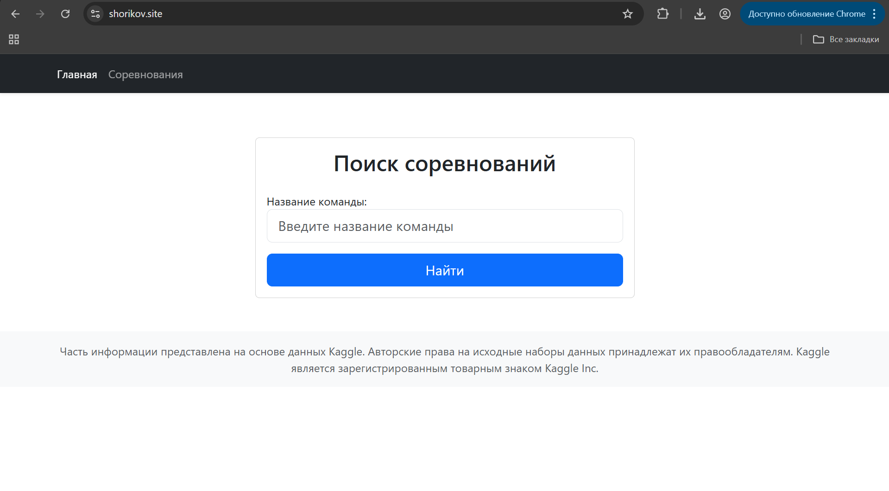
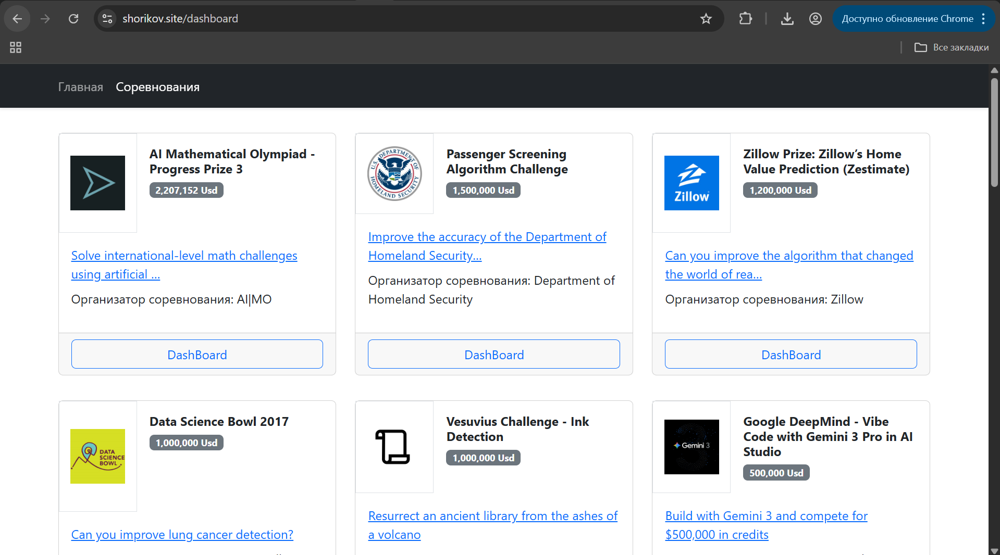
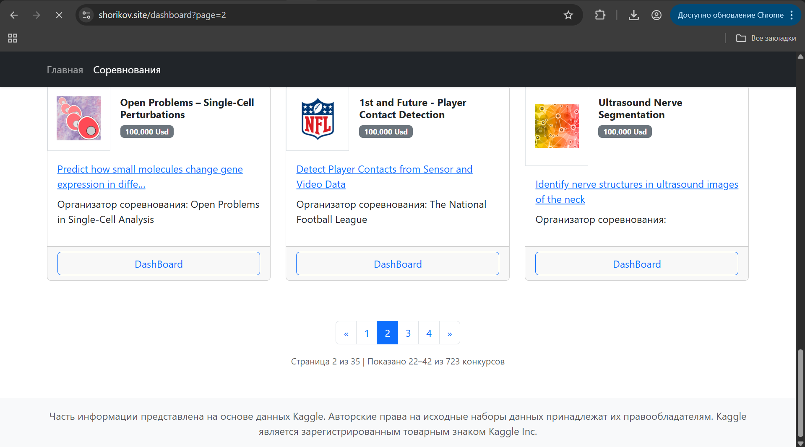

# [KaggleStat]

Сервис собирает открытую информацию посредством Kaggle API для отслеживания истории лидербордов.
Сайт пригодится активным участникам соревнований и для пользователей, которые хотят увидеть динамику изменения участников лидерборда.

**Ссылка на рабочий проект:** [Тык](https://shorikov.site)

## Технологии
* **Python 3.12**
* **Django 5.2**
* **Chart.js**
* **sqlite3**
* **crontab**
* **[KaggleAPI](https://github.com/Kaggle/kaggle-api)**
* **[Bootstrap 5](https://getbootstrap.su/)**

## Скриншоты


*На главной странице есть форма ввода ника команды, которая находилась в лидерборде. После ввода, происходит редирект на страницу соревнований.*



*На странице присутствуют карточки с информацией о соревнованиях и кнопкой DashBoard. При нажатии на нее происходит редирект на страницу с формой и графиками.*


*Демонстрация пагинации.*


*Форма поиска команды в лидерборде, обязательно заполнить поля с временем ранжирования информации. После нажатия на кнопку появляются графики.*


*График с позициями и очками выбранной команды в конкретный промежуток времени.*

## Как запустить проект локально
1. **[Создайте API ключ в личном кабинете Kaggle](https://www.kaggle.com/settings)**:
   Я использовал Legacy ключ. Скачиваем и помещаем json в папку 
   /home/ubuntu/.config/.kaggle # для Linux/Mac
   /c/Users/user/.kaggle     # для Windows
2. **Клонируйте репозиторий:**
   ```bash
   git clone [https://github.com/EgorShorikov/KaggleStat.git](https://github.com/EgorShorikov/KaggleStat.git)
   cd KaggleStat
   ```
3. **Создайте и активируйте виртуальное окружение:**
   ```bash
   python -m venv venv
   source venv/bin/activate  # для Linux/Mac
   venv\Scripts\activate     # для Windows
   ```
4. **Создайте .env:**
    ```bash
   nano .env
    ```
   Вставьте 
   ```bash
   SECRET_KEY='ВАШ ДЖАНГО КЛЮЧ'
   DEBUG=True
   ALLOWED_HOSTS=localhost,127.0.0.1
   ```
   Примечание: Для генерации SECRET_KEY можно использовать команду:
   ```bash
   python -c "from django.core.management.utils import get_random_secret_key; print(get_random_secret_key())"
   ```
5. **Выполните миграции:**
   ```bash
   cd kaggle_stat
   python manage.py migrate
   ```
6. **Запустите сервер:**
   ```bash
   python manage.py runserver
   ```
7. **Откройте проект в браузере:**
   Перейдите по ссылке: http://127.0.0.1:8000/